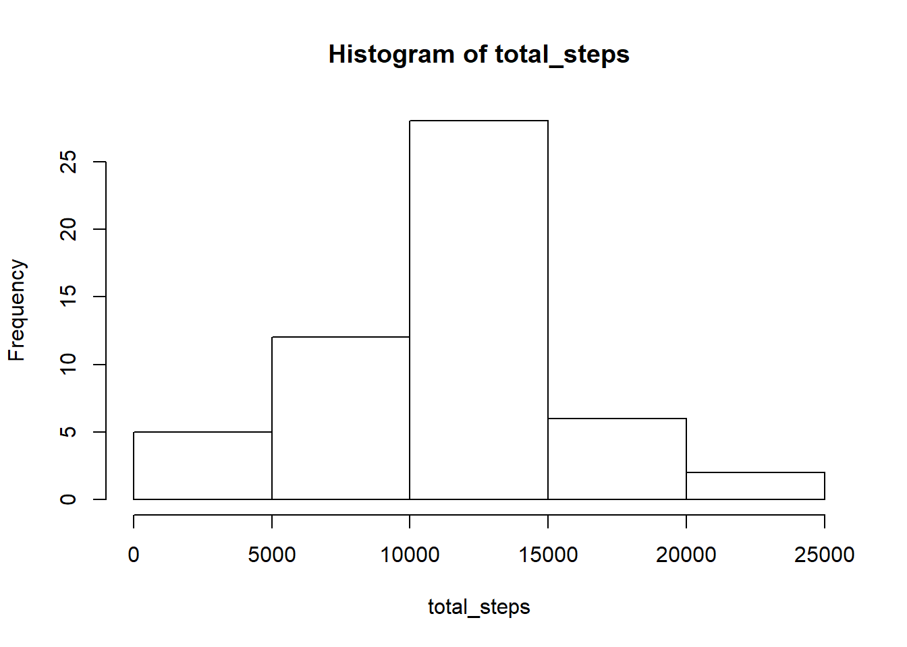
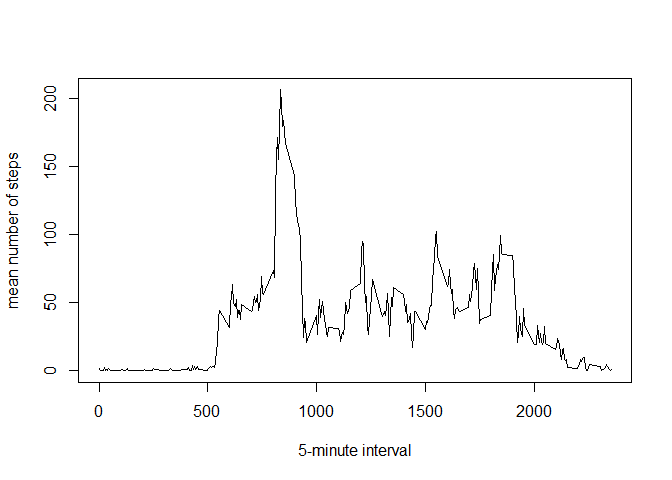
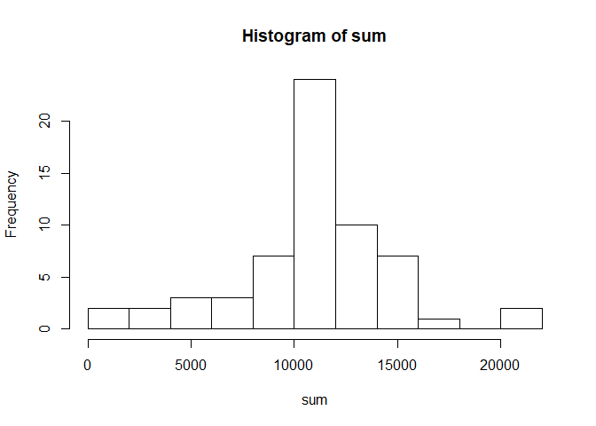

## Loading and preprocessing the data

Load the data into a dataframe.

```r
unzip("activity.zip")
DF<- read.csv("activity.csv")
```
Use `tidyverse` and `lubridate` to make the date column read as dates, the interval column as factors, and turn the whole dataframe into a tibble.

```r
library(tidyverse)
```

```
## Warning: package 'tidyverse' was built under R version 3.5.3
```

```
## -- Attaching packages -------------------------------------------------------------------------------------- tidyverse 1.2.1 --
```

```
## v ggplot2 3.2.0     v purrr   0.3.2
## v tibble  2.1.3     v dplyr   0.8.2
## v tidyr   0.8.3     v stringr 1.4.0
## v readr   1.3.1     v forcats 0.4.0
```

```
## Warning: package 'ggplot2' was built under R version 3.5.3
```

```
## Warning: package 'tibble' was built under R version 3.5.3
```

```
## Warning: package 'tidyr' was built under R version 3.5.3
```

```
## Warning: package 'purrr' was built under R version 3.5.3
```

```
## Warning: package 'dplyr' was built under R version 3.5.3
```

```
## Warning: package 'forcats' was built under R version 3.5.3
```

```
## -- Conflicts ----------------------------------------------------------------------------------------- tidyverse_conflicts() --
## x dplyr::filter() masks stats::filter()
## x dplyr::lag()    masks stats::lag()
```

```r
library(lubridate)
```

```
## Warning: package 'lubridate' was built under R version 3.5.3
```

```
## 
## Attaching package: 'lubridate'
```

```
## The following object is masked from 'package:base':
## 
##     date
```

```r
DF$date <- ymd(DF$date)
DF$interval <- as.factor(DF$interval)
DF<- as_tibble(DF)
DF
```

```
## # A tibble: 17,568 x 3
##    steps date       interval
##    <int> <date>     <fct>   
##  1    NA 2012-10-01 0       
##  2    NA 2012-10-01 5       
##  3    NA 2012-10-01 10      
##  4    NA 2012-10-01 15      
##  5    NA 2012-10-01 20      
##  6    NA 2012-10-01 25      
##  7    NA 2012-10-01 30      
##  8    NA 2012-10-01 35      
##  9    NA 2012-10-01 40      
## 10    NA 2012-10-01 45      
## # ... with 17,558 more rows
```


## What is the mean total number of steps taken per day?

For this part of the assignment, you can ignore the missing values in the dataset.

 1. **Make a histogram of the total number of steps taken each day.**
 
First, figure out the total number of steps taken each day using `dplyr` to group by date and then summarize across the mean of all steps. 

```r
newDF <- na.omit(DF)
by_date<- newDF %>%   
  group_by(date,add=TRUE) %>%
  summarise(total_steps=sum(steps))
by_date
```

```
## # A tibble: 53 x 2
##    date       total_steps
##    <date>           <int>
##  1 2012-10-02         126
##  2 2012-10-03       11352
##  3 2012-10-04       12116
##  4 2012-10-05       13294
##  5 2012-10-06       15420
##  6 2012-10-07       11015
##  7 2012-10-09       12811
##  8 2012-10-10        9900
##  9 2012-10-11       10304
## 10 2012-10-12       17382
## # ... with 43 more rows
```

Now create the histogram, using 10 breaks to get slightly more detail than the default.

```r
with(by_date,hist(total_steps, breaks=10))
```

<!-- -->

 2. **Calculate and report the mean and median total number of steps taken per day**

<!-- This table, for no good reason, gives the mean of each day over every 5 minute interval. But that's not what we're looking for.  -->
<!-- ```{r} -->
<!-- by_date_mean <- newDF %>% -->
<!--   group_by(date) %>% -->
<!--   summarise(mean_steps=mean(steps)) -->
<!-- by_date_mean -->
<!-- ``` -->

What we're looking for is the mean and median total number of steps taken when we add up the total number of steps per day, not including NAs but including zeros. Those figures are below. 

```r
mean(by_date$total_steps)
```

```
## [1] 10766.19
```


```r
median(by_date$total_steps)
```

```
## [1] 10765
```

## What is the average daily activity pattern?

 1. **Make a time series plot (i.e. `type = "l"`) of the 5-minute interval (x-axis) and the average number of steps taken, averaged across all days (y-axis).**

First, group the data frame (without `NA`s) by 5-minute intervals, then summarize by the mean of steps per 5-minuteinterval. 

```r
by_interval_mean <-newDF %>%
  group_by(interval) %>%
  summarize(mean_steps =mean(steps))
by_interval_mean
```

```
## # A tibble: 288 x 2
##    interval mean_steps
##    <fct>         <dbl>
##  1 0            1.72  
##  2 5            0.340 
##  3 10           0.132 
##  4 15           0.151 
##  5 20           0.0755
##  6 25           2.09  
##  7 30           0.528 
##  8 35           0.868 
##  9 40           0     
## 10 45           1.47  
## # ... with 278 more rows
```

Now create the desired plot.


```r
with(by_interval_mean,plot(interval,mean_steps,type="l",xlab="5-minute interval",ylab="mean number of steps"))
```

<!-- -->

 2. **Which 5-minute interval, on average across all the days in the dataset, contains the maximum number of steps?**

We must select the row that contains the largest mean number of steps. As it turn out, interval `835` contains the most steps, `206.168`, which can be rounded to `206`. 
 

```r
by_interval_mean[which.max(by_interval_mean$mean_steps),]
```

```
## # A tibble: 1 x 2
##   interval mean_steps
##   <fct>         <dbl>
## 1 835            206.
```

## Imputing missing values

Note that there are a number of days/intervals where there are missing values (coded as NA). The presence of missing days may introduce bias into some calculations or summaries of the data.

1. Calculate and report the total number of missing values in the dataset (i.e. the total number of rows with NAs)


```r
summary(DF)
```

```
##      steps             date               interval    
##  Min.   :  0.00   Min.   :2012-10-01   0      :   61  
##  1st Qu.:  0.00   1st Qu.:2012-10-16   5      :   61  
##  Median :  0.00   Median :2012-10-31   10     :   61  
##  Mean   : 37.38   Mean   :2012-10-31   15     :   61  
##  3rd Qu.: 12.00   3rd Qu.:2012-11-15   20     :   61  
##  Max.   :806.00   Max.   :2012-11-30   25     :   61  
##  NA's   :2304                          (Other):17202
```

There are `2,304 NA` values. 


2. Devise a strategy for filling in all of the missing values in the dataset. The strategy does not need to be sophisticated. For example, you could use the mean/median for that day, or the mean for that 5-minute interval, etc.

Using `tidyr` we can create a `61 x 280` table with every day as a row and every 5 minute integrval as a column. Then using sapply we can replace each `NA` with the mean number of steps in its column.


```r
 DFlong <- spread(DF,interval,steps)
DFlong
```

```
## # A tibble: 61 x 289
##    date         `0`   `5`  `10`  `15`  `20`  `25`  `30`  `35`  `40`  `45`
##    <date>     <int> <int> <int> <int> <int> <int> <int> <int> <int> <int>
##  1 2012-10-01    NA    NA    NA    NA    NA    NA    NA    NA    NA    NA
##  2 2012-10-02     0     0     0     0     0     0     0     0     0     0
##  3 2012-10-03     0     0     0     0     0     0     0     0     0     0
##  4 2012-10-04    47     0     0     0     0     0     0     0     0     0
##  5 2012-10-05     0     0     0     0     0     0     0     0     0     0
##  6 2012-10-06     0     0     0     0     0     0     0     0     0     0
##  7 2012-10-07     0     0     0     0     0     0     0     0     0     0
##  8 2012-10-08    NA    NA    NA    NA    NA    NA    NA    NA    NA    NA
##  9 2012-10-09     0     0     0     0     0    13    28     0     0     0
## 10 2012-10-10    34    18     7     0     0     0     0     0     0     0
## # ... with 51 more rows, and 278 more variables: `50` <int>, `55` <int>,
## #   `100` <int>, `105` <int>, `110` <int>, `115` <int>, `120` <int>,
## #   `125` <int>, `130` <int>, `135` <int>, `140` <int>, `145` <int>,
## #   `150` <int>, `155` <int>, `200` <int>, `205` <int>, `210` <int>,
## #   `215` <int>, `220` <int>, `225` <int>, `230` <int>, `235` <int>,
## #   `240` <int>, `245` <int>, `250` <int>, `255` <int>, `300` <int>,
## #   `305` <int>, `310` <int>, `315` <int>, `320` <int>, `325` <int>,
## #   `330` <int>, `335` <int>, `340` <int>, `345` <int>, `350` <int>,
## #   `355` <int>, `400` <int>, `405` <int>, `410` <int>, `415` <int>,
## #   `420` <int>, `425` <int>, `430` <int>, `435` <int>, `440` <int>,
## #   `445` <int>, `450` <int>, `455` <int>, `500` <int>, `505` <int>,
## #   `510` <int>, `515` <int>, `520` <int>, `525` <int>, `530` <int>,
## #   `535` <int>, `540` <int>, `545` <int>, `550` <int>, `555` <int>,
## #   `600` <int>, `605` <int>, `610` <int>, `615` <int>, `620` <int>,
## #   `625` <int>, `630` <int>, `635` <int>, `640` <int>, `645` <int>,
## #   `650` <int>, `655` <int>, `700` <int>, `705` <int>, `710` <int>,
## #   `715` <int>, `720` <int>, `725` <int>, `730` <int>, `735` <int>,
## #   `740` <int>, `745` <int>, `750` <int>, `755` <int>, `800` <int>,
## #   `805` <int>, `810` <int>, `815` <int>, `820` <int>, `825` <int>,
## #   `830` <int>, `835` <int>, `840` <int>, `845` <int>, `850` <int>,
## #   `855` <int>, `900` <int>, `905` <int>, ...
```

3. Create a new dataset that is equal to the original dataset but with the missing data filled in.

Create a new data frame by applying a function which replaces every `NA` with the mean of the column containing it.


```r
DFlong_impute_mean  <- data.frame(sapply(DFlong,function(x) ifelse(is.na(x),mean(x,na.rm=TRUE),x)))
#change that data.frame into a tibble
DFlong_impute_mean<- as_tibble(DFlong_impute_mean)
# replace the date column with a properly formatted date
DFlong_impute_mean$date <- DFlong$date
DFlong_impute_mean
```

```
## # A tibble: 61 x 289
##    date          X0     X5   X10   X15    X20   X25    X30   X35   X40
##    <date>     <dbl>  <dbl> <dbl> <dbl>  <dbl> <dbl>  <dbl> <dbl> <dbl>
##  1 2012-10-01  1.72  0.340 0.132 0.151 0.0755  2.09  0.528 0.868     0
##  2 2012-10-02  0     0     0     0     0       0     0     0         0
##  3 2012-10-03  0     0     0     0     0       0     0     0         0
##  4 2012-10-04 47     0     0     0     0       0     0     0         0
##  5 2012-10-05  0     0     0     0     0       0     0     0         0
##  6 2012-10-06  0     0     0     0     0       0     0     0         0
##  7 2012-10-07  0     0     0     0     0       0     0     0         0
##  8 2012-10-08  1.72  0.340 0.132 0.151 0.0755  2.09  0.528 0.868     0
##  9 2012-10-09  0     0     0     0     0      13    28     0         0
## 10 2012-10-10 34    18     7     0     0       0     0     0         0
## # ... with 51 more rows, and 279 more variables: X45 <dbl>, X50 <dbl>,
## #   X55 <dbl>, X100 <dbl>, X105 <dbl>, X110 <dbl>, X115 <dbl>, X120 <dbl>,
## #   X125 <dbl>, X130 <dbl>, X135 <dbl>, X140 <dbl>, X145 <dbl>,
## #   X150 <dbl>, X155 <dbl>, X200 <dbl>, X205 <dbl>, X210 <dbl>,
## #   X215 <dbl>, X220 <dbl>, X225 <dbl>, X230 <dbl>, X235 <dbl>,
## #   X240 <dbl>, X245 <dbl>, X250 <dbl>, X255 <dbl>, X300 <dbl>,
## #   X305 <dbl>, X310 <dbl>, X315 <dbl>, X320 <dbl>, X325 <dbl>,
## #   X330 <dbl>, X335 <dbl>, X340 <dbl>, X345 <dbl>, X350 <dbl>,
## #   X355 <dbl>, X400 <dbl>, X405 <dbl>, X410 <dbl>, X415 <dbl>,
## #   X420 <dbl>, X425 <dbl>, X430 <dbl>, X435 <dbl>, X440 <dbl>,
## #   X445 <dbl>, X450 <dbl>, X455 <dbl>, X500 <dbl>, X505 <dbl>,
## #   X510 <dbl>, X515 <dbl>, X520 <dbl>, X525 <dbl>, X530 <dbl>,
## #   X535 <dbl>, X540 <dbl>, X545 <dbl>, X550 <dbl>, X555 <dbl>,
## #   X600 <dbl>, X605 <dbl>, X610 <dbl>, X615 <dbl>, X620 <dbl>,
## #   X625 <dbl>, X630 <dbl>, X635 <dbl>, X640 <dbl>, X645 <dbl>,
## #   X650 <dbl>, X655 <dbl>, X700 <dbl>, X705 <dbl>, X710 <dbl>,
## #   X715 <dbl>, X720 <dbl>, X725 <dbl>, X730 <dbl>, X735 <dbl>,
## #   X740 <dbl>, X745 <dbl>, X750 <dbl>, X755 <dbl>, X800 <dbl>,
## #   X805 <dbl>, X810 <dbl>, X815 <dbl>, X820 <dbl>, X825 <dbl>,
## #   X830 <dbl>, X835 <dbl>, X840 <dbl>, X845 <dbl>, X850 <dbl>,
## #   X855 <dbl>, X900 <dbl>, ...
```

4. Make a histogram of the total number of steps taken each day and Calculate and report the mean and median total number of steps taken per day. Do these values differ from the estimates from the first part of the assignment? What is the impact of imputing missing data on the estimates of the total daily number of steps?


```r
# add a new column called `sum' which is the sum of all steps for that day.
DFlong_impute_mean$sum <- rowSums(DFlong_impute_mean[,2:289])
# view the column that was just created
DFlong_impute_mean[,290]
```

```
## # A tibble: 61 x 1
##       sum
##     <dbl>
##  1 10766.
##  2   126 
##  3 11352 
##  4 12116 
##  5 13294 
##  6 15420 
##  7 11015 
##  8 10766.
##  9 12811 
## 10  9900 
## # ... with 51 more rows
```
Now the histogram with the same number of bins as before. 

```r
with(DFlong_impute_mean[,290],hist(sum,breaks=10))
```

<!-- -->

Taking the median and mean of the `sum` column we see they are now identical. Replacing each `NA` with the mean of its five minute interval for that day seems to have brought the mean and median together.

```r
mean(DFlong_impute_mean$sum)
```

```
## [1] 10766.19
```

```r
median(DFlong_impute_mean$sum)
```

```
## [1] 10766.19
```

Because I am too lazy to use an if-than statement I noted that these are 61 consecutive days in a row starting with a Monday, so I created a vector consisting of "no","no","no","no","no","yes","yes" corresponding to whether or not the days Monday through Sunday are weekend days. I created 8 copies of that vector `7x8=56` and then added 5 more "no"s to the end of that for Monday thorugh Friday inclusive making a `61x1` vector, which I simply appended to the long table and made into a factor. 


```r
weekend <- c(rep(c(rep("no",5),rep("yes",2)),8),c(rep("no",5)))
DFlong_impute_mean$weekend <- weekend
DFlong_impute_mean$weekend <- as.factor(DFlong_impute_mean$weekend)
```
