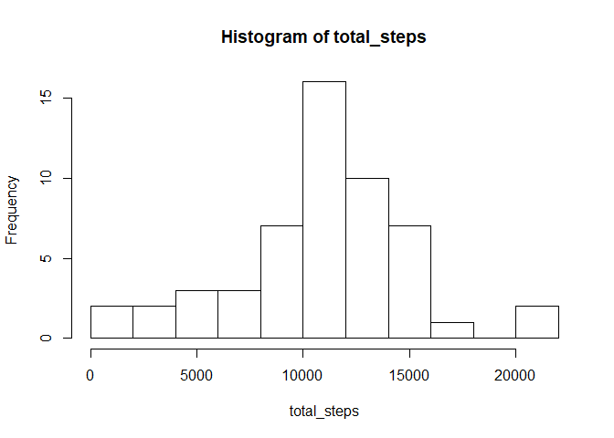

## Loading and preprocessing the data

Load the data into a dataframe.

```r
unzip("activity.zip")
DF<- read.csv("activity.csv")
```
Use `tidyverse` and `lubridate` to make the date column read as dates, the interval column as factors, and turn the whole dataframe into a tibble.

```r
library(tidyverse)
```

```
## Warning: package 'tidyverse' was built under R version 3.5.3
```

```
## -- Attaching packages ---------------------------- tidyverse 1.2.1 --
```

```
## v ggplot2 3.2.0     v purrr   0.3.2
## v tibble  2.1.3     v dplyr   0.8.2
## v tidyr   0.8.3     v stringr 1.4.0
## v readr   1.3.1     v forcats 0.4.0
```

```
## Warning: package 'ggplot2' was built under R version 3.5.3
```

```
## Warning: package 'tibble' was built under R version 3.5.3
```

```
## Warning: package 'tidyr' was built under R version 3.5.3
```

```
## Warning: package 'purrr' was built under R version 3.5.3
```

```
## Warning: package 'dplyr' was built under R version 3.5.3
```

```
## Warning: package 'forcats' was built under R version 3.5.3
```

```
## -- Conflicts ------------------------------- tidyverse_conflicts() --
## x dplyr::filter() masks stats::filter()
## x dplyr::lag()    masks stats::lag()
```

```r
library(lubridate)
```

```
## Warning: package 'lubridate' was built under R version 3.5.3
```

```
## 
## Attaching package: 'lubridate'
```

```
## The following object is masked from 'package:base':
## 
##     date
```

```r
DF$date <- ymd(DF$date)
DF$interval <- as.factor(DF$interval)
DF<- as_tibble(DF)
DF
```

```
## # A tibble: 17,568 x 3
##    steps date       interval
##    <int> <date>     <fct>   
##  1    NA 2012-10-01 0       
##  2    NA 2012-10-01 5       
##  3    NA 2012-10-01 10      
##  4    NA 2012-10-01 15      
##  5    NA 2012-10-01 20      
##  6    NA 2012-10-01 25      
##  7    NA 2012-10-01 30      
##  8    NA 2012-10-01 35      
##  9    NA 2012-10-01 40      
## 10    NA 2012-10-01 45      
## # ... with 17,558 more rows
```


## What is the mean total number of steps taken per day?

For this part of the assignment, you can ignore the missing values in the dataset.

 1. **Make a histogram of the total number of steps taken each day.**
 
First, figure out the total number of steps taken each day using `dplyr` to group by date and then summarize across the mean of all steps. 

```r
newDF <- na.omit(DF)
by_date<- newDF %>%   
  group_by(date,add=TRUE) %>%
  summarise(total_steps=sum(steps))
by_date
```

```
## # A tibble: 53 x 2
##    date       total_steps
##    <date>           <int>
##  1 2012-10-02         126
##  2 2012-10-03       11352
##  3 2012-10-04       12116
##  4 2012-10-05       13294
##  5 2012-10-06       15420
##  6 2012-10-07       11015
##  7 2012-10-09       12811
##  8 2012-10-10        9900
##  9 2012-10-11       10304
## 10 2012-10-12       17382
## # ... with 43 more rows
```

Now create the histogram, using 10 breaks to get slightly more detail than the default.

```r
with(by_date,hist(total_steps, breaks=10))
```

<!-- -->

 2. **Calculate and report the mean and median total number of steps taken per day**

<!-- This table, for no good reason, gives the mean of each day over every 5 minute interval. But that's not what we're looking for.  -->
<!-- ```{r} -->
<!-- by_date_mean <- newDF %>% -->
<!--   group_by(date) %>% -->
<!--   summarise(mean_steps=mean(steps)) -->
<!-- by_date_mean -->
<!-- ``` -->

What we're looking for is the mean and median total number of steps taken when we add up the total number of steps per day, not including NAs but including zeros. Those figures are below. 

```r
mean(by_date$total_steps)
```

```
## [1] 10766.19
```


```r
median(by_date$total_steps)
```

```
## [1] 10765
```

## What is the average daily activity pattern?

 1. **Make a time series plot (i.e. `type = "l"`) of the 5-minute interval (x-axis) and the average number of steps taken, averaged across all days (y-axis).**

First, group the data frame (without `NA`s) by 5-minute intervals, then summarize by the mean of steps per 5-minuteinterval. 

```r
by_interval_mean <-newDF %>%
  group_by(interval) %>%
  summarize(mean_steps =mean(steps))
by_interval_mean
```

```
## # A tibble: 288 x 2
##    interval mean_steps
##    <fct>         <dbl>
##  1 0            1.72  
##  2 5            0.340 
##  3 10           0.132 
##  4 15           0.151 
##  5 20           0.0755
##  6 25           2.09  
##  7 30           0.528 
##  8 35           0.868 
##  9 40           0     
## 10 45           1.47  
## # ... with 278 more rows
```

Now create the desired plot.


```r
with(by_interval_mean,plot(interval,mean_steps,type="l",xlab="5-minute interval",ylab="mean number of steps"))
```

<!-- -->

 2. **Which 5-minute interval, on average across all the days in the dataset, contains the maximum number of steps?**

We must select the row that contains the largest mean number of steps. As it turn out, interval `835` contains the most steps, `206.168`, which can be rounded to `206`. 
 

```r
by_interval_mean[which.max(by_interval_mean$mean_steps),]
```

```
## # A tibble: 1 x 2
##   interval mean_steps
##   <fct>         <dbl>
## 1 835            206.
```

## Imputing missing values

Note that there are a number of days/intervals where there are missing values (coded as NA). The presence of missing days may introduce bias into some calculations or summaries of the data.

1. Calculate and report the total number of missing values in the dataset (i.e. the total number of rows with NAs)


```r
summary(DF)
```

```
##      steps             date               interval    
##  Min.   :  0.00   Min.   :2012-10-01   0      :   61  
##  1st Qu.:  0.00   1st Qu.:2012-10-16   5      :   61  
##  Median :  0.00   Median :2012-10-31   10     :   61  
##  Mean   : 37.38   Mean   :2012-10-31   15     :   61  
##  3rd Qu.: 12.00   3rd Qu.:2012-11-15   20     :   61  
##  Max.   :806.00   Max.   :2012-11-30   25     :   61  
##  NA's   :2304                          (Other):17202
```

There are `2,304 NA` values. 


2. Devise a strategy for filling in all of the missing values in the dataset. The strategy does not need to be sophisticated. For example, you could use the mean/median for that day, or the mean for that 5-minute interval, etc.

3. Create a new dataset that is equal to the original dataset but with the missing data filled in.

4. Make a histogram of the total number of steps taken each day and Calculate and report the mean and median total number of steps taken per day. Do these values differ from the estimates from the first part of the assignment? What is the impact of imputing missing data on the estimates of the total daily number of steps?
